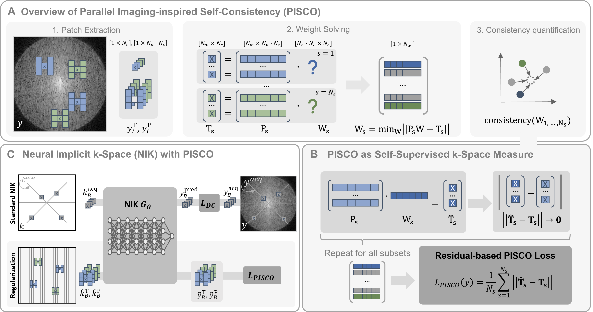

# PISCO: Self-supervised k-space regularization for improved neural implicit k-space representations of dynamic MRI

Published at Medical Image Analysis: [https://doi.org/10.1016/j.media.2025.103890](https://doi.org/10.1016/j.media.2025.103890)

**Veronika Spieker**, Hannah Eichhorn, Wenqi Huang, Jonathan K. Stelter, Tabita Catalan, Rickmer F. Braren, Daniel Rueckert, Francisco Sahli Costabal, Kerstin Hammernik, Dimitrios C. Karampinos, Claudia Prieto, Julia A. Schnabel


(A) Overview of proposed concept of parallel imaging-inspired self-consistency (PISCO).
(B) Inclusion of PISCO in the training of neural implicit k-space representations (NIK).

**Abstract:** 
Neural implicit k-space representations (NIK) have shown promising results for dynamic magnetic resonance imaging (MRI) at high temporal resolutions. Yet, reducing acquisition time, and thereby available training data, results in severe performance drops due to overfitting. To address this, we introduce a novel self-supervised k-space loss function LPISCO, applicable for regularization of NIK-based reconstructions. The proposed loss function is based on the concept of parallel imaging-inspired self-consistency (PISCO), enforcing a consistent global k-space neighborhood relationship without requiring additional data. Quantitative and qualitative evaluations on static and dynamic MR reconstructions show that integrating PISCO significantly improves NIK representations, making it a competitive dynamic reconstruction method without constraining the temporal resolution. Particularly at high acceleration factors (R ≥ 50), NIK with PISCO can avoid temporal oversmoothing of state-of-the-art methods and achieves superior spatio-temporal reconstruction quality. Furthermore, an extensive analysis of the loss assumptions and stability shows PISCO’s potential as versatile self-supervised k-space loss function for further applications and architectures. Code is available at: https://github.com/compai-lab/2025-pisco-spieker

**Keywords:**
Dynamic MRI reconstruction · Parallel imaging · K-space refinement · Self-supervised learning · Neural implicit representations · Non-uniform sampling

## Citation
If you use this code, please cite our paper:

```
@incollection{Spieker_2024_pisco,
title = {PISCO: Self-supervised k-space regularization for improved neural implicit k-space representations of dynamic MRI},
journal = {Medical Image Analysis},
volume = {109},
year = {2026},
doi = {https://doi.org/10.1016/j.media.2025.103890}
}
```

# If you want to solely use the **PISCO loss** for your reconstruction:
You can find the pisco loss in `losses/pisco.py`. Make sure to download `losses/pisco.py`, `utils/losses.py`
and `utils/kernel_coords.py` to your project and adapt the imports accordingly.
Then the PISCO PyTorch module can be used in your training loop as follows:

1. Initialize PISCO
  ```
  from losses.pisco import PISCOLoss
  
  config = ... # your configuration
  pisco = PISCOLoss(config)
  ```

2. Within Training Loop:
```
### Define your pairs of target and patch coordinates (coords_T, coords_P) 

# a) manually:
coords_T, coords_P = ...

# b) with the sampling function in PISCOLoss:
sample = pisco.sample_patches(sample)  # sample is a dictionary containing the key "coords" 
coords_T, coords_P = sample['coords_T'], sample['coords_P']

### Predict the k-space values for the target and patch coordinates with your model
T, P = yourmodel(coords_T, coords_P) 

### Compute the data consistency loss with your model
loss_dc = yourloss(T, T_gt)  # your data consistency loss compared to the ground truth

### Compute the PISCO loss for regularization and the weights that PISCO solved for
loss_reg, weight_dict = pisco(T, P, coords_T, coords_P)

### Combine the losses
loss = loss_dc + loss_reg
```


# If you want to run **NIK with PISCO** on public cardiac data or your data:

## General Setup
1. Create conda environment (some manual installs are also required to ensure compatibility)
```
conda env create -f environment_pisco_nik.yml
conda activate pisco_nik
pip install medutils-mri
pip install torchvision==0.14.1+cu116 --extra-index-url https://download.pytorch.org/whl/cu116
```
2. For setting up wandb please refer to the [IML-CompAI Framework](https://github.com/compai-lab/iml-dl).

## Data Preparation / Preprocessing
For evaluation purposes we provide the preprocessing script for the public cardiac dataset used in this publication. To reproduce these steps and create the same preprocessed dataset:
1. Download the desired data from [here](https://dataverse.harvard.edu/dataset.xhtml?persistentId=doi%3A10.7910%2FDVN%2FCI3WB6&version=2.0&q=&fileTypeGroupFacet=%22Data%22&fileAccess=&fileTag=&fileSortField=&fileSortOrder=&tagPresort=false&folderPresort=true) and save in ```dummy_data/raw```
2. Run ```dummy_data/run_preprocess_data_cardiac.ipynb``` - this creates the sensmaps, preprocessed k-space and reference reconstruction
3. Exemplary XD-GRASP reference reconstructions are also provided in ```dummy_data/grasprecon``` (for Subject 10/R104)


## Training

### Dataset Configuration
Adapt the source paths for your data in the subjet-specific config files under `configs/subjects`. 
E.g. for the cardiac adapt the _data_root_ and _results_root_ in `configs/subjects/cardiac.yml` to your data paths. 
Further, you can create new dataclasses here with dataset-specific configuration settings. 
This also required expanding the datasets folder with `utils_$youdataset$`.

### Model Configuration
Adapt the model configuration in `configs/$MODEL$/...` to your needs. The model configuration is used to define the model architecture and training hyperparameters.
We provide the following model configs:
- `configs/nik`: Standard [NIK](https://github.com/wenqihuang/NIK_MRI) model with self-supervised k-space regularization
- `configs/pisco`: NIK model with **proposed** **PISCO** regularization
- `configs/pisco_dist`: NIK model with distance-based PISCO regularization
(**PISCO-dist**: [Paper](https://link.springer.com/chapter/10.1007/978-3-031-72104-5_59) / [Code](https://github.com/vjspi/PISCO-NIK))
- `configs/iconik`: ICoNIK implementation with regularization calibrated on k-space center 
(**ICoNIK**: [Paper](https://link.springer.com/chapter/10.1007/978-3-031-53767-7_18) / [Code](https://github.com/vjspi/ICoNIK))

### Training
To train a model with PISCO, run the following command:
```
python train_pisco.py --config $CONFIG$ --subject $SUBJECT$ --slice $SLICE$ -r $ACC_FACTOR$
```
where `$CONFIG$` is the model configuration, `$SUBJECT$` is the dataset configuration, `$SLICE$` is the slice index to train on, `$ACC_FACTOR$` is the acceleration factor.

In our case we ran the following models (example for cardiac data subject 10, acc_factor 104, slice 0):
```
# Standard NIK
train_pisco.py --config "configs/nik/exp_config_basic_cardiac.yml" -sub cardiac10 -s 0 -r 104
# NIK with proposed PISCO
train_pisco.py --config "configs/pisco/exp_config_kreg_cardiac.yml" -sub cardiac10 -s 0 -r 104
# NIK with PISCO_dist
train_pisco.py --config "configs/pisco_dist/exp_config_kreg_cardiac.yml" -sub cardiac10 -s 0 -r 104
# ICoNIK
train_iconik.py --config "configs/iconik/config_cardiac_iconik.yml" -sub cardiac10 -s 0 -r 104
```

### Eval
To give an overview of the evaluation pipeline, we provide model checkpoints and 
reconstructions for the exemplary cardiac dataset (Sub10, R104) in `results\checkpoints`.
To evaluate the trained models and create a comparison figure & evaluation metrics run `results\run_pisco_eval.ipynb`.

## Content Overview:
- `environment_pisco_nik.yml`: Conda environment file
- `train_pisco.py/`: Training script for NIK using self-supervised k-space regularization PISCO
- `train_iconik.py/`: Training script for ICoNIK using self-supervised k-space regularization PISCO
- `test_pisco.py/`: Script for running trained model
- `config/`: Configuration files for 
  - `config/subject/...` subject specific configurations (create new one per dataset)
  - `config/$exp$/...` experiments and model configurations
- `datasets/`: Data loading and preprocessing
- `dummy_data/`: Exemplary data for cardiac dataset including script for preprocessing
- `losses/`: Loss functions including the **proposed self-supervised k-space regularization PISCO** (`losses/pisco.py`)
- `models/`: Model architectures
- `utils/`: Helper functions
- `results/`: Exemplary model checkpoints and reconstructions and evaluation script

